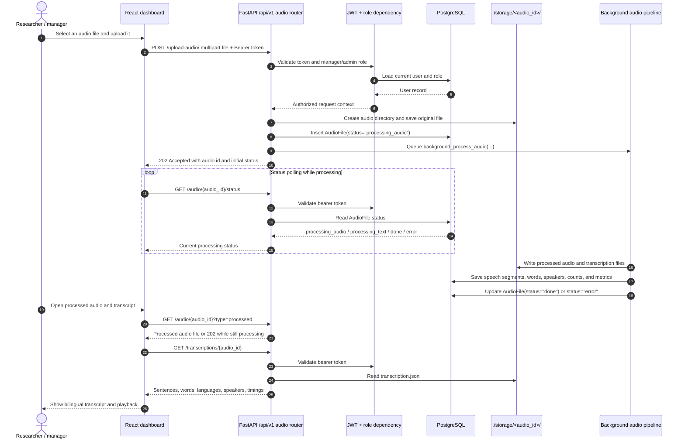
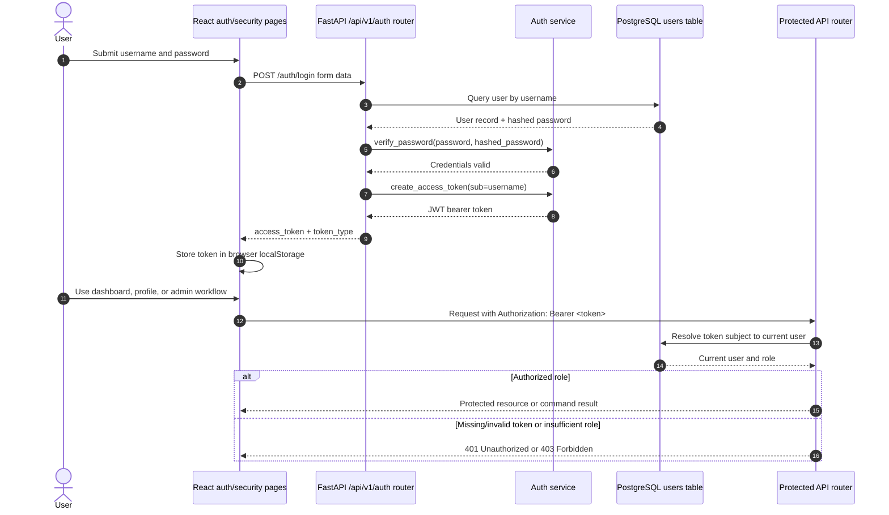

# Architecture

This is the canonical maintained architecture index artifact for **Bilingual Speech Recognition**. It describes the current delivered architecture, explains the maintained architecture views in context, links the supporting view artifacts, and acts as the index home for the maintained Architecture Decision Record (ADR) set.

The product supports researchers working with Russian–Tatar bilingual family audio recordings. The delivered system provides browser-based authentication, role-aware audio upload, asynchronous speech processing, transcript retrieval, playback, search, corpus metadata, and user/account administration.

## Maintained artifact structure

The maintained architecture documentation is kept under `docs/architecture/`.

- [Static view assets](static-view/) are stored in `docs/architecture/static-view/`.
- [Dynamic view assets](dynamic-view/) are stored in `docs/architecture/dynamic-view/`.
- [Deployment view assets](deployment-view/) are stored in `docs/architecture/deployment-view/`.
- [Architecture Decision Records](#architecture-decision-record-index) are stored in `docs/architecture/adr/` as separate ADR files.
- [Quality attribute scenarios](quality-attribute-scenarios.md) summarize the quality drivers that the views and ADRs should stay aligned with.
- [Architecture traceability map](architecture-traceability.md) records the relationship between architecture elements, ADRs, quality concerns, and evidence links that should be filled as PBIs, PRs, CI jobs, and quality-requirement tests are introduced.

The Mermaid `.mmd` files are the maintained diagram source artifacts. For readability, each maintained diagram is embedded directly below and linked to its source file. No separate rendered SVG/PNG artifacts are currently maintained; if rendered artifacts are added later, keep the source and rendered forms linked together from this index.

## Assignment 5 traceability context

This maintained architecture update is prepared for **Assignment 5**. The repository evidence item provided for this update is [issue #140, "Done user stories"](https://github.com/SWP-Team20/Bilingual-speech-recognition/issues/140). That issue is treated as course/documentation evidence rather than as a product PBI because it is labeled as a Course Task and its expected deliverable is the finalized `docs/user-stories.md` artifact. Product-scope traceability remains anchored in the stable user-story IDs from `docs/user-stories.md` and the Sprint plan from `docs/roadmap.md`.

Current Sprint context from `docs/roadmap.md`:

| Sprint | Dates | Sprint goal | Architecture-relevant selected work |
|---|---|---|---|
| Sprint 1 | 15.06.2026-21.06.2026 | Implement and Verify MVP v1 | US-003 Transcription, US-009 Audio upload, US-015 Audio streams page |
| Sprint 2 | 22.06.2026-28.06.2026 | Fix MVP v1 issues and start MVP v2 | US-011 Speakers in transcription, US-014 Login page, US-016 Audio deletion, security protocol change, Russian localization, profile maintenance |
| Sprint 3 | 29.06.2026-05.07.2026 | Implement and Verify MVP v2 | US-002 Filter by speakers, US-010 Correct mistakes, US-012 Filter by date, US-013 Filter by language, US-018 Tags for audio upload, US-019 Admin page and functionality, US-021 Audio storage size information |


## Maintained process semantics

Starting with Assignment 5, this architecture documentation and the ADRs are maintained product assets. A product change must update these artifacts when it materially changes product scope, architecture, deployment shape, integrations, important quality risks, or architecture decisions.

This documentation follows these maintenance rules:

- Describe the current delivered architecture rather than a speculative target architecture.
- Preserve history for significant decisions. Do not delete an ADR just because a decision changes; create a new ADR or update status/links according to the ADR status rules below.
- Keep stable architecture view locations unless a later assignment explicitly replaces or extends them.
- Keep diagrams readable in this README and keep the source diagrams in their maintained view directories.
- Link architecture decisions to the views, quality concerns, stable user-story IDs, quality requirements, quality-requirement tests, and verification evidence they affect.
- Keep architecture evidence aligned with `docs/user-stories.md`, `docs/roadmap.md`, `docs/definition-of-done.md`, `docs/quality-requirements.md`, and `docs/quality-requirements-tests.md`.
- When canonical quality-requirement and quality-requirement-test artifacts are updated, keep the ADR quality sections and [architecture traceability map](architecture-traceability.md) aligned with those IDs.

## Current system context

Researchers and team users access the application from a browser. The React/Vite frontend calls the FastAPI backend through `/api/v1` endpoints using JSON, form data, range/file requests, and multipart audio upload requests. The backend stores relational metadata and searchable transcript indexes in PostgreSQL. Large uploaded and generated artifacts stay on the backend filesystem under `./storage/<audio_id>/`.

Speech processing is delivered as a local backend capability rather than as a separate external service. Upload requests create an `AudioFile` record, save the original file, and schedule a background pipeline that performs audio preprocessing, language identification, ASR, diarization, transcript generation, and searchable word indexing.

The current deployment boundary is a development/VM-style application host with three main runtime parts: Vite frontend, Uvicorn/FastAPI backend, and PostgreSQL in Docker. The speech-processing models and local artifact directory are deployment-relevant backend dependencies.

## Source alignment

This document is aligned with these implementation areas:

| Area | Implementation paths | Architectural meaning |
|---|---|---|
| Frontend | `frontend/`, `frontend/src/`, `frontend/package.json` | React/Vite single-page UI using route-level pages and shared API client modules. |
| Backend API | `backend/src/main.py`, `backend/src/routers/` | FastAPI app with `/api/v1` routers for audio, authentication, and administration. |
| Authentication and authorization | `backend/src/dependencies.py`, `backend/src/services/auth.py`, `backend/src/routers/auth.py`, frontend token handling | JWT bearer authentication with role checks for restricted workflows. |
| Persistence | `backend/src/database.py`, `backend/src/models.py` | PostgreSQL accessed through SQLAlchemy for users, audio metadata, speakers, segments, words, word counts, and metrics. |
| File artifacts | `backend/src/routers/audio.py`, `./storage/` | Audio and transcript files are stored in per-audio filesystem directories; the database stores metadata and paths. |
| Processing pipeline | `backend/src/pipeline.py` and related ASR/LID/diarization modules | Background audio-processing pipeline for VAD, ASR, language tagging, diarization, metrics, and indexing. |
| Deployment | `docs/deployment.md` | Current deployment runs PostgreSQL in Docker, FastAPI with Uvicorn on port `8000`, and Vite on port `5173`. |
| Quality requirements and tests | `docs/quality-requirements.md`, `docs/quality-requirements-tests.md` | Canonical quality-requirement and automated quality-requirement-test artifacts. Current stable IDs include QR-001, QR-002, QR-003 and QRT-001, QRT-002, QRT-003. |
| Product work evidence | Issue tracker PBIs, linked PRs/MRs, CI jobs, manual evidence where applicable | Live traceability evidence for architecture-affecting changes. The [architecture traceability map](architecture-traceability.md) records the architecture side of these links. |
| User-story registry and sprint plan | `docs/user-stories.md`, `docs/roadmap.md` | Stable user-story IDs and Sprint membership. Architecture-relevant stories include upload, transcription, login, deletion, filters, tags, admin functions, and storage-size reporting. |
| Completion standard | `docs/definition-of-done.md` | Done requires acceptance criteria, review, CI checks, automated tests, relevant QRTs, verification evidence, and changelog updates for user-visible changes. |

## Quality attribute drivers

These are architecture-level quality concerns that the current structure supports, constrains, or leaves risky. They are aligned with the current canonical quality requirements and tests in `docs/quality-requirements.md` and `docs/quality-requirements-tests.md`.

| ISO/IEC 25010 concern | Current architectural support | Current limitation or follow-up | Related ADRs / QR links |
|---|---|---|---|
| Functional suitability | Audio, transcription, search, authentication, and administration capabilities are separated into API routers and frontend pages. | New corpus workflows should preserve these boundaries instead of mixing UI, persistence, and processing concerns. | ADR-002, ADR-003; US-003, US-009, US-015, US-019 |
| Confidentiality and integrity | JWT authentication, password hashing, role checks, and a backend CORS allow-list protect the main workflows and protected audio access. | Token storage in browser `localStorage` and hard-coded local database credentials are accepted current constraints; stronger session and secret management should be revisited before production hardening. | ADR-004; [QR-001](../quality-requirements.md#qr-001-audio-files-confidentiality); [QRT-001](../quality-requirements-tests.md#qrt-001-unauthorized-audio-access-verification) |
| Time behaviour | Uploads return after storing the file and scheduling background work; users do not wait for long ASR processing during the initial request. | ASR throughput remains limited by local model load time and available CPU/GPU resources. | ADR-003 |
| Resource utilization | Large audio/transcript artifacts are not stored directly in relational tables. | The local filesystem must be backed up and sized separately from the database. | ADR-001, ADR-002; US-021 |
| Availability and fault tolerance | Processing statuses such as `processing_audio`, `processing_text`, `done`, and `error` let the UI poll and recover from long-running work. | Background tasks are currently local-process work; a durable queue would improve recovery after backend restarts. | ADR-003 |
| Modifiability and testability | Frontend API access, backend routers, schemas, models, authentication code, and pipeline code have separate responsibilities. Architecture diagrams are stored as versioned Mermaid source. | Pipeline changes and deployment changes are architecturally significant and should update views, ADRs, and traceability in the same PR. | ADR-002, ADR-003, ADR-004, ADR-005; [QR-002](../quality-requirements.md#qr-002-front-end-code-and-build-quality); [QRT-002](../quality-requirements-tests.md#qrt-002-front-end-production-build-and-code-quality-verification) |
| Pull-request compliance and maintainability | PR-quality checks require a non-empty description, completed mandatory checkboxes, and a valid tracking issue reference. | Architecture-affecting PRs must still manually ensure the architecture README, ADRs, view diagrams, and traceability map stay current. | ADR-005; [QR-003](../quality-requirements.md#qr-003-pull-request-quality-and-compliance-check); [QRT-003](../quality-requirements-tests.md#qrt-003-pull-request-compliance-static-analysis-test) |
| Deployability and operability | Development/VM deployment uses three understandable runtime pieces: Vite frontend, Uvicorn/FastAPI backend, and PostgreSQL container. | Production deployment still needs explicit decisions for TLS termination, persistent filesystem backup, model-cache management, environment variables, and observability. | ADR-001, ADR-002, ADR-003 |

## Static view: component diagram

Source: [`static-view/component-diagram.mmd`](static-view/component-diagram.mmd)

This component view shows the delivered system at runtime. The frontend owns browser interaction and API calls. The backend owns API boundaries, authentication, file serving, background processing, and persistence coordination. PostgreSQL stores metadata and searchable transcript data, while the filesystem stores large audio and generated transcript artifacts. Local speech-processing models are shown as backend runtime dependencies because they affect deployment preparation, processing performance, and failure modes.

Relevant ADRs: [ADR-001 Store audio artifacts on the backend filesystem](adr/ADR-001-store-audio-artifacts-on-backend-filesystem.md), [ADR-002 Use PostgreSQL for metadata and searchable transcript indexes](adr/ADR-002-use-postgresql-for-metadata-and-search-indexes.md), [ADR-003 Run speech processing as FastAPI background work](adr/ADR-003-run-speech-processing-as-fastapi-background-work.md), [ADR-004 Use JWT bearer tokens for API authentication](adr/ADR-004-use-jwt-bearer-tokens-for-api-authentication.md).

```mermaid
flowchart LR
    Actor["Researcher / manager / admin"] --> Browser["Browser"]

    subgraph Frontend["frontend/ — React + Vite single-page app"]
        App["Application routes"]
        AuthPage["Authentication page"]
        Dashboard["Dashboard / corpus page"]
        SecurityPage["Profile and security page"]
        ApiClient["Shared Axios API client\nbase URL + bearer-token interceptor"]
        AudioApi["audio API module"]
        UserApi["user/auth API module"]

        App --> AuthPage
        App --> Dashboard
        App --> SecurityPage
        AuthPage --> ApiClient
        Dashboard --> AudioApi
        SecurityPage --> UserApi
        AudioApi --> ApiClient
        UserApi --> ApiClient
    end

    Browser --> App

    subgraph Backend["backend/src — FastAPI service"]
        FastAPI["FastAPI app\nCORS + /api/v1 routers"]
        AudioRouter["audio router\nupload, files, status, transcription, search"]
        AuthRouter["auth router\nlogin, profile, password, self-delete"]
        AdminRouter["admin router\nuser management"]
        AuthDependency["auth dependencies\nJWT validation + role checks"]
        AuthService["auth service\npassword hashing + token creation"]
        Pipeline["audio-processing pipeline\nVAD, LID, ASR, diarization, language tagging"]
        Indexing["indexing logic\nwords, speakers, segments, metrics"]
        Models["SQLAlchemy models\nUser, AudioFile, Speaker, Word, WordCount, SpeechSegment"]
        Schemas["Pydantic schemas\nrequest/response contracts"]

        FastAPI --> AudioRouter
        FastAPI --> AuthRouter
        FastAPI --> AdminRouter
        AudioRouter --> AuthDependency
        AuthRouter --> AuthService
        AuthRouter --> AuthDependency
        AdminRouter --> AuthDependency
        AudioRouter --> Pipeline
        Pipeline --> Indexing
        AudioRouter --> Schemas
        AuthRouter --> Schemas
        AdminRouter --> Schemas
        AudioRouter --> Models
        AuthRouter --> Models
        AdminRouter --> Models
        Indexing --> Models
    end

    ApiClient -->|HTTP(S) JSON, form data, multipart upload| FastAPI

    subgraph Persistence["Persistence and generated artifacts"]
        Postgres[("PostgreSQL\nusers, metadata, searchable transcript index")]
        Storage["./storage/<audio_id>/\noriginal audio, processed audio, transcription.txt, transcription.json"]
        DbVolume[("db_storage Docker volume")]
    end

    Models -->|SQLAlchemy sessions| Postgres
    Postgres --- DbVolume
    AudioRouter -->|save and serve audio/transcript files| Storage
    Pipeline -->|write generated artifacts| Storage
    Pipeline -->|update status and metrics| Postgres
    Indexing -->|persist words, speakers, segments, counts| Postgres

    subgraph LocalML["Local ML / speech-processing dependencies"]
        WhisperRU["Whisper large-v3\nRussian ASR"]
        TatarASR["Tatar ASR model"]
        MMSLID["MMS language identification"]
        Diarization["SpeechBrain + clustering\nspeaker diarization"]
    end

    Pipeline --> WhisperRU
    Pipeline --> TatarASR
    Pipeline --> MMSLID
    Pipeline --> Diarization

```

### Component responsibilities

| Component | Responsibility |
|---|---|
| React/Vite frontend | Presents login, dashboard/corpus browsing, playback, transcription, profile/security, and admin-facing screens. |
| Shared API client | Centralizes backend base URL configuration, bearer-token injection, and request handling for frontend API modules. |
| FastAPI app | Hosts the `/api/v1` API surface and applies CORS configuration. |
| Audio router | Handles audio upload, listing, retrieval, status checks, transcription retrieval/update, search, metadata edits, and delete operations. |
| Auth/admin routers | Handle login, current-user profile, password/account actions, and admin user management. |
| Auth dependencies/services | Validate JWTs, enforce roles, hash and verify passwords, and create bearer tokens. |
| Audio-processing pipeline | Produces processed audio, transcript files, language/speaker/word metadata, and metrics from uploaded audio. |
| PostgreSQL | Stores users, audio metadata, speakers, speech segments, words, word counts, and processing metrics. |
| Backend filesystem storage | Stores original audio, processed audio, and generated `transcription.txt`/`transcription.json` files per audio record. |
| Local ML model dependencies | Provide Russian ASR, Tatar ASR, language identification, and diarization capabilities loaded by the backend processing pipeline. |

## Dynamic view: sequence diagrams

The dynamic view focuses on the two architecturally important runtime flows: asynchronous audio processing and authenticated API access. These flows are important because they define user-visible responsiveness, security boundaries, persistence updates, artifact creation, and error-state recovery.

### Audio upload and transcription sequence

Source: [`dynamic-view/upload-and-transcription-sequence.mmd`](dynamic-view/upload-and-transcription-sequence.mmd)

This sequence explains how the user-visible upload workflow remains responsive while heavy speech processing continues in the backend. The API persists initial metadata, schedules background processing, and returns `202 Accepted`; the UI then polls status until transcript and processed-audio artifacts are available.

Relevant ADRs: [ADR-001](adr/ADR-001-store-audio-artifacts-on-backend-filesystem.md), [ADR-002](adr/ADR-002-use-postgresql-for-metadata-and-search-indexes.md), [ADR-003](adr/ADR-003-run-speech-processing-as-fastapi-background-work.md), [ADR-004](adr/ADR-004-use-jwt-bearer-tokens-for-api-authentication.md).



### Authentication and protected request sequence

Source: [`dynamic-view/authentication-sequence.mmd`](dynamic-view/authentication-sequence.mmd)

This sequence explains the current delivered authentication semantics. Users log in with username/password credentials, receive a bearer token, and the frontend attaches the token to protected API calls. Backend dependencies resolve the token subject to the current user and enforce role checks where required.

Relevant ADR: [ADR-004 Use JWT bearer tokens for API authentication](adr/ADR-004-use-jwt-bearer-tokens-for-api-authentication.md).



## Deployment view: deployment diagram

Source: [`deployment-view/deployment-diagram.mmd`](deployment-view/deployment-diagram.mmd)

The deployment view describes the current delivered development/VM topology. The browser reaches the Vite frontend on port `5173`. The frontend calls the FastAPI backend on port `8000`. The backend connects to a PostgreSQL Docker container through host port `15432`, reads and writes local audio artifacts under `./storage/`, and loads local speech-processing models.

Relevant ADRs: [ADR-001](adr/ADR-001-store-audio-artifacts-on-backend-filesystem.md), [ADR-002](adr/ADR-002-use-postgresql-for-metadata-and-search-indexes.md), [ADR-003](adr/ADR-003-run-speech-processing-as-fastapi-background-work.md).

```mermaid
flowchart TB
    User["Researcher / team member browser"]

    subgraph Host["Application host — developer machine or Innopolis VM"]
        Vite["Frontend process\nVite + React\nHTTP/HTTPS :5173"]
        Uvicorn["Backend API process\nUvicorn + FastAPI\nHTTP/HTTPS :8000"]
        Storage["Local application storage\n./storage/<audio_id>/"]
        ModelCache["Local ML model cache\nWhisper, MMS-LID, SpeechBrain, Tatar ASR"]

        subgraph Docker["Docker runtime"]
            PgContainer["pg-container\nPostgreSQL :5432"]
            PgVolume[("db_storage volume")]
            PgContainer --- PgVolume
        end

        Vite -->|/api/v1 HTTP(S) calls| Uvicorn
        Uvicorn -->|SQLAlchemy connection\n127.0.0.1:15432| PgContainer
        Uvicorn -->|read/write uploaded and generated files| Storage
        Uvicorn -->|load local speech-processing models| ModelCache
    end

    User -->|HTTP(S) :5173| Vite
    User -.->|optional API docs / direct API access :8000| Uvicorn
    Vite -.|origin must match backend CORS allow-list| Uvicorn

```

### Deployment notes

- The Vite frontend is the browser entry point for the current delivered app and local development.
- The FastAPI backend exposes `/api/v1` routes and interactive API documentation on the backend port.
- PostgreSQL runs in a Docker container named `pg-container` and persists data in the `db_storage` Docker volume.
- The backend uses a local filesystem directory, `./storage/<audio_id>/`, for original audio, processed audio, and transcript artifacts.
- Local ML model artifacts are runtime dependencies of the backend environment and should be treated as part of deployment preparation.
- The current deployment shape is not horizontally scalable without changing filesystem sharing, background-job execution, and model-cache assumptions.
- Production hardening should add explicit decisions for TLS termination, secret management, environment-variable configuration, storage backup/restore, model-cache provisioning, and observability.

## Architecture Decision Record index

`docs/architecture/README.md` is the maintained index home for the ADR set. A separate `docs/architecture/adr/README.md` file is not required.

Store every ADR as a separate file in `docs/architecture/adr/` using the required filename pattern `ADR-001-short-description.md`, where the descriptive slug is stable, lowercase, and hyphen-separated. Keep the stable ADR ID after creation and do not change, reuse, or reassign it.

Allowed ADR statuses are:

- `Proposed` — a documented candidate decision that has not yet been adopted.
- `Accepted` — the current adopted decision.
- `Superseded` — replaced by a later ADR; the ADR must include an explicit `Superseded by: ADR-...` link.
- `Deprecated` — no longer recommended or no longer applicable without one direct replacement ADR.

Each ADR must define the stable ID, status, context, decision, consequences and tradeoffs, and quality requirements or quality concerns addressed where applicable.

| ADR | Status | Decision scope | Quality concerns addressed | Used by architecture views |
|---|---|---|---|---|
| [ADR-001 Store audio artifacts on the backend filesystem](adr/ADR-001-store-audio-artifacts-on-backend-filesystem.md) | Accepted | Audio and generated transcript file storage | Resource utilization, deployability, operability, fault tolerance | Static, dynamic, deployment |
| [ADR-002 Use PostgreSQL for metadata and searchable transcript indexes](adr/ADR-002-use-postgresql-for-metadata-and-search-indexes.md) | Accepted | Relational metadata and corpus search data | Modifiability, testability, integrity, performance efficiency | Static, dynamic, deployment |
| [ADR-003 Run speech processing as FastAPI background work](adr/ADR-003-run-speech-processing-as-fastapi-background-work.md) | Accepted | Asynchronous upload-to-transcription processing | Time behaviour, availability, fault tolerance, modifiability | Static, dynamic, deployment |
| [ADR-004 Use JWT bearer tokens for API authentication](adr/ADR-004-use-jwt-bearer-tokens-for-api-authentication.md) | Accepted | Authentication and protected API semantics | Confidentiality, integrity, operability, modifiability | Static, dynamic |
| [ADR-005 Maintain architecture diagrams as Mermaid source](adr/ADR-005-maintain-architecture-diagrams-as-mermaid-source.md) | Accepted | Diagrams-as-code and maintained documentation readability | Modifiability, analysability, testability, PR compliance | Static, dynamic, deployment, README |

## Traceability and evidence

The [architecture traceability map](architecture-traceability.md) is the supporting architecture asset for preserving relationships between architecture elements, views, ADRs, quality concerns, and implementation evidence. The issue tracker and pull requests remain the live source for PBI execution state; this architecture index records what must be connected.

When architecture-affecting PBIs, PRs/MRs, CI jobs, quality-requirement tests, manual evidence, or reported test results are introduced, update the traceability map and the relevant ADR links. Use the stable IDs assigned by the canonical product artifacts such as user stories, PBIs, `QR-...`, `QRT-...`, and `UAT-...`. Treat [issue #140](https://github.com/SWP-Team20/Bilingual-speech-recognition/issues/140) as Assignment 5/course evidence for user-story documentation, not as a product user-story ID.

## Known architectural constraints

- The backend currently couples audio artifact storage to a local filesystem path. This is simple and matches the delivered deployment, but it constrains horizontal scaling and backup strategy.
- Background processing currently runs inside the backend process. This keeps the architecture lightweight, but failed/restarted backend processes can interrupt long processing work.
- The database connection string and some local deployment values are currently development-oriented. Production hardening should externalize secrets and environment-specific configuration.
- The frontend stores bearer tokens in browser `localStorage`. This supports the current SPA flow but should be reassessed if stricter browser-session security is required.
- Local ML model availability, model-cache size, and CPU/GPU capacity are deployment-relevant factors that can affect throughput and operability.

## Update checklist

Before merging a change that affects architecture, update the relevant maintained artifacts:

- [ ] `docs/architecture/README.md` still describes the current delivered architecture.
- [ ] The source Mermaid assets in `static-view/`, `dynamic-view/`, and `deployment-view/` still match the implemented system.
- [ ] Related ADR files in `docs/architecture/adr/` are created or updated when a significant decision, tradeoff, or consequence changes.
- [ ] ADR status/history is preserved when decisions are superseded or deprecated.
- [ ] Quality attribute scenarios remain consistent with the canonical quality requirements and quality requirement tests.
- [ ] Architecture traceability links are updated for relevant ADRs, quality requirements, quality requirement tests, PBIs, PRs/MRs, CI jobs, manual evidence, and reported test results where applicable.
- [ ] Deployment documentation is updated when ports, services, storage, credentials, TLS assumptions, model dependencies, or operational boundaries change.
